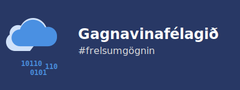

# Gagnavinafélagið – Stofngögn

Velkomin á vinnusvæði Gagnavinafélagsins!

Gagnavinafélagið er félag í stofnun sem hefur þann tilgang að vinna að auknu aðgengi almennings að opinberum gögnum og upplýsingum. Við trúum því að opið aðgengi sé hornsteinn upplýsts lýðræðis og skilvirkrar stjórnsýslu.

## Um þessi skjöl

Hér í möppunni má finna drög að þeim skjölum sem mynda lagalegan og stefnumarkandi grunn að félaginu. Markmiðið með að birta þau hér er að fá athugasemdir og ábendingar frá verðandi félagsmönnum og öðrum velunnurum.

Skjölin eru:

* **[`stofnsamningur.md`](stofnsamningur.md)**: Formlegur samningur um stofnun félagsins.
* **[`samthykktir.md`](samthykktir.md)**: Lög og reglur félagsins. Þetta er stjórnarskrá okkar.
* **[`stofnfundargerd.md`](stofnfundargerd.md)**: Sniðmát að fundargerð fyrir formlegan stofnfund.
* **[`stefna-um-gagnabeidnir.md`](stefna-um-gagnabeidnir.md)**: Drög að stefnu um hvernig félagið mun standa að beiðnum um gögn, kærum og birtingu.
* **[`myndir/`](myndir)**: Tillögur að logo fyrir félagið.

**Vinsamlegast athugið:** Öll skjölin eru drög og við fögnum öllum ábendingum sem geta gert þau betri.

## Athugasemdir og þátttaka

Við viljum heyra frá þér! Ef þú hefur ábendingar, spurningar eða hugmyndir að breytingum eru eftirfarandi leiðir bestar:

1.  **Stofna „Issue“**: Fyrir almennar umræður, spurningar eða hugmyndir sem ekki fela í sér beina textabreytingu er best að [stofna nýtt „Issue“](https://github.com/gagnavinafelagid/stofnun/issues).
2.  **Gera „Pull Request“**: Ef þú vilt leggja til beinar breytingar á texta skjalanna er skilvirkast að gera „Pull Request“ með breytingartillögum þínum.

Við stefnum á að fara yfir allar ábendingar sem berast.

## Næstu skref

1.  Safna saman ábendingum og fullvinna stofngögnin.
2.  Boða til formlegs stofnfundar.
3.  Stofna félagið og skrá það í almannaheillafélagaskrá.
4.  Hefja störf!

Hefur þú áhuga á að gerast stofnfélagi? [Skráðu þig á áhugalista](https://docs.google.com/forms/d/e/1FAIpQLSchiIPnYRMKLja2mg3iddHJLQeoooEZ72BdWwEEDLO9auM0nw/viewform?usp=header) og við leyfum þér að fylgjast með
